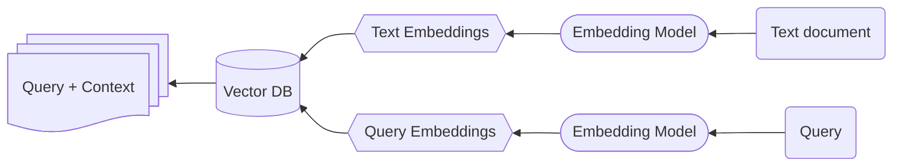

# query-engine-RAG

A query engine that uses Retrieval Augmented Generation (RAG) to answer questions about a text.

```mermaid
flowchart RL
	id1(Text document) --> id2([Embedding Model]);
	id2 --> id3@{ shape: hex, label: "Text Embeddings"};
	id3 --> id4[(Vector DB)];
	id5(Query) --> id6([Embedding Model]);
	id6 --> id7@{ shape: hex, label: "Query Embeddings"};
	id7 --> id4;
	id4 --> id8@{ shape: docs, label: "Query + Context"};
```

Extended description coming soon!