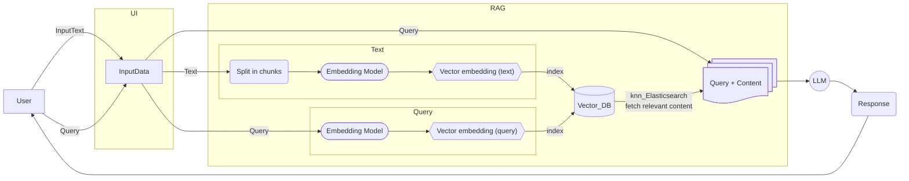

# query-engine-RAG

A query engine that uses Retrieval Augmented Generation (RAG) to assist LLMs in answering questions about a text. The RAG approach improves the performance of a LLMs by providing relevant context to a user query. This is achieved by retrieving content from a database that satisfies some similarity threshold with the query.

## How the app works

The user provides an input text and a query about this text to the user interface (UI). The text is read, processed, and split into sentences using the spaCy trained pipeline [en_core_web_sm](https://spacy.io/models/en), an English pipeline trained on written web text, in order to preserve the semantics. The spaCy pipeline allows to process the text as a stream and buffer the paragraphs in batches. A [FlagEmbedding model](https://huggingface.co/BAAI/bge-small-zh-v1.5) is used to create vector embeddings of the text in batches of n text chunks that contain a preset number of sentences each. The vector embeddings are indexed and stored in a vector database in pairs along with the corresponding chunks of text using the Python client for Elasticsearch. Similarly, the user query is embedded and indexed in the vector database alongside with vector embeddings of the text.

A k-nearest neighbour (kNN) search is implemented in Elasticsearch in order to retrieve the top-k relevant content results from the vector database by computing the cosine-similarity between the query and the text embeddings. The retrieved relevant content and query are passed as a prompt to an LLM in order to answer the user's question.

Extended description coming soon!
